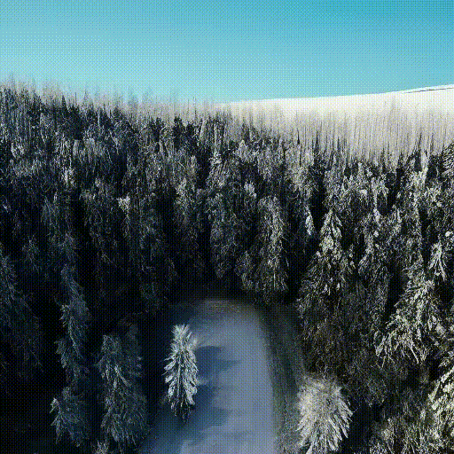

#  ViDiT-Q

### [📖 Paper](https://arxiv.org/abs/2406.02540) | [🖥️ Project Page](https://a-suozhang.xyz/viditq.github.io/) 

This repo contains the official code of [ViDiT-Q: Efficient and Accurate Quantization of Diffusion Transformers for Image and Video Generation](https://arxiv.org/abs/2406.02540)

We introduce ViDiT-Q, a quantization method specialized for diffusion transformers. For popular large-scale models (e.g., open-sora, Latte, Pixart-α, Pixart-Σ) for the video and image generation task, ViDiT-Q could achieve W8A8 quantization without metric degradation, and W4A8 without notable visual quality degradation.


ViDiT-Q could generate videos/images with negligible discrepancy with the FP16 baseline:

| **FP16** | **Baseline Quant W8A8**  |  **ViDiT-Q W8A8** |
|---|---|---|
|  |  |  |
|  |  |   |


For more information, please refer to our [Project Page: https://a-suozhang.xyz/viditq.github.io/](https://a-suozhang.xyz/viditq.github.io/)

# Env Setup

We recommend using conda for enviornment management. 

```shell 
cd diffuser-dev

# create a virtual env
conda create -n viditq python=3.10
# activate virtual environment
conda activate viditq

conda install pytorch==2.1.1 torchvision==0.16.1 torchaudio==2.1.1 pytorch-cuda=12.1 -c pytorch -c nvidia

pip install -r t2i/requirements_pixart.txt

pip install -r t2v/requirements_opensora.txt

pip install -r t2v/requirements_qdiff.txt

# install flash attention (optional)
pip install packaging ninja
pip install flash-attn --no-build-isolation

# install xformers
pip3 install xformers==0.0.23

# install the python package
# install qdiff
pip install -e .

# install opensora
cd t2v
pip install -e .
```

<br>

# Commands to Run

> *After running the following commands, the output (ckpt,generated videos) will appear in the `./logs/`.*

We also provide the shell scripts for all process below. The shell scripts are in the `t2i/shell_scripts` and `t2v/shell_scripts`.
For example, run `bash t2v/shell_scripts/get_calib_data.sh $GPU_ID` to generate the calibration dataset.

## 🎬 video generation

we provide the precomputed `text_embeds.pth` for 10 opensora example prompts, which help to avoid loading the t5 ckpts onto GPU (which takes around 1 min) . Please add `--precompute_text_embeds ./t2v/utils_files/text_embeds.pth` when running command.

### 1. load checkpoint of the STDiT model
> Please ref [doc of open-sora v1.0](https://github.com/hpcaitech/Open-Sora) for more details, we only support OpenSORA v1.0 for now, we are supporting more recent models.

- Download the OpenSora-v1-HQ-16x512x512.pth from [this link](https://huggingface.co/hpcai-tech/Open-Sora/blob/main/OpenSora-v1-HQ-16x512x512.pth)


### 2. modify the checkpoint

> the original opensora code merges the qkv linears into a linear layer with more channels, we split it into 3 layers for quantization. 

- specify the path to downloaded checkpoint in `t2v/scripts/split_ckpt.py`

```shell
python t2v/scripts/split_ckpt.py
```


### 3. FP16 inference

```shell
CFG="./t2v/configs/opensora/inference/16x512x512.py"  # the opensora config
CKPT_PATH="./logs/split_ckpt/OpenSora-v1-HQ-16x512x512-split.pth"  # your path of splited ckpt
OUTDIR="./logs/fp16_inference"  # your_path_to_save_videos
GPU_ID=$1

CUDA_VISIBLE_DEVICES=$GPU_ID python t2v/scripts/inference.py $CFG --ckpt_path $CKPT_PATH  --outdir $OUTDIR \
--precompute_text_embeds ./t2v/utils_files/text_embeds.pth
```


### 4. get calib data

```shell
CFG="./t2v/configs/opensora/inference/16x512x512.py" # the opensora config
CKPT_PATH="./logs/split_ckpt/OpenSora-v1-HQ-16x512x512-split.pth"  # splited ckpt
GPU_ID=$1
CALIB_DATA_DIR="./logs/calib_data"  # the path to save your calib dataset

# quant calib data
CUDA_VISIBLE_DEVICES=$GPU_ID python t2v/scripts/get_calib_data.py $CFG --ckpt_path $CKPT_PATH --data_num 10 --outdir $CALIB_DATA_DIR --save_dir $CALIB_DATA_DIR \
--precompute_text_embeds ./t2v/utils_files/text_embeds.pth
```

### 5. Post Training Quantization (PTQ) Process

#### 5.1 normal ptq
* we take w8a8 ptq as an example
```shell
CFG="./t2v/configs/quant/W8A8/16x512x512.py"  # the opensora config
Q_CFG="./t2v/configs/quant/W8A8/opensora.yml"  # the config of PTQ
CKPT_PATH="/logs/split_ckpt/OpenSora-v1-HQ-16x512x512-split.pth"  # splited ckpt generated by split_ckpt.py
OUTDIR="./logs/w8a8_ptq"  # your path to save the ptq result
CALIB_DATA_DIR="./logs/calib_data"  # your path of calib data
GPU_ID=$1

# ptq
CUDA_VISIBLE_DEVICES=$GPU_ID python scripts/ptq.py $CFG --ckpt_path $CKPT_PATH --ptq_config $Q_CFG --outdir $OUTDIR \
    --calib_data $CALIB_DATA_DIR/calib_data.pt \
    --part_fp \
    --precompute_text_embeds ./t2v/utils_files/text_embeds.pth
```

#### 5.2 ptq with naive smooth quant
* we take w6a6 ptq as an example
```shell
CFG="./t2v/configs/quant/W6A6_Naive_Smooth/16x512x512.py"  # the opensora config
Q_CFG="./t2v/configs/quant/W6A6_Naive_Smooth/opensora.yml"  # the config of PTQ
CKPT_PATH="/logs/split_ckpt/OpenSora-v1-HQ-16x512x512-split.pth"  # splited ckpt generated by split_ckpt.py
OUTDIR="./logs/w6a6_naive_smooth_ptq"  # your path to save the ptq result
CALIB_DATA_DIR="./logs/calib_data"  # your path of calib data
GPU_ID=$1

# ptq
CUDA_VISIBLE_DEVICES=$GPU_ID python scripts/ptq.py $CFG --ckpt_path $CKPT_PATH --ptq_config $Q_CFG --outdir $OUTDIR \
    --calib_data $CALIB_DATA_DIR/calib_data.pt \
    --part_fp \
    --precompute_text_embeds ./t2v/utils_files/text_embeds.pth
```

#### 5.3 ptq with timestep-aware smooth quant
* we take w4a8 ptq as an example
```shell
CFG="./t2v/configs/quant/W4A8_Timestep-aware_smooth/16x512x512.py" # the opensora config
Q_CFG="./t2v/configs/quant/W4A8_Timestep-aware_smooth/config.yaml" # the config of PTQ
CKPT_PATH="./logs/split_ckpt/OpenSora-v1-HQ-16x512x512-split.pth"  # splited ckpt generated by split_ckpt.py
OUTDIR="./logs/W4A8_Timestep-aware_smooth"  # your path to save the ptq result
CALIB_DATA_DIR="./logs/calib_data"  # your path of calib data
GPU_ID=$1  # your path to save generated videos

# ptq
CUDA_VISIBLE_DEVICES=$GPU_ID python t2v/scripts/ptq.py $CFG --outdir $OUTDIR \
	--calib_data $CALIB_DATA_DIR/calib_data.pt \
	--ptq_config $Q_CFG \
	--ckpt_path $CKPT_PATH \
	--part_fp \
	--precompute_text_embeds ./t2v/utils_files/text_embeds.pth
```


### 6. Inference Quantized Model

#### 6.1 normal inference
* we take w8a8 ptq as an example
```shell
CFG="./t2v/configs/quant/W8A8/16x512x512.py" # the opensora config
CKPT_PATH="./logs/split_ckpt/OpenSora-v1-HQ-16x512x512-split.pth"  # your path of splited ckpt
OUTDIR="./logs/w8a8_ptq"  # your path of the w8a8 ptq result
GPU_ID=$1
SAVE_DIR="w8a8_samples"  # your path to save generated videos

# quant inference
CUDA_VISIBLE_DEVICES=$GPU_ID python t2v/scripts/quant_txt2video.py $CFG \
    --outdir $OUTDIR --ckpt_path $CKPT_PATH  \
    --dataset_type opensora \
    --part_fp \
    --save_dir $SAVE_DIR \
    --precompute_text_embeds ./t2v/utils_files/text_embeds.pth
```

#### 6.2 inference with mixed precision
* we take w4a8 ptq as an example
```shell
CFG="./t2v/configs/quant/W4A8_Naive_Smooth/16x512x512.py" # the opensora config
CKPT_PATH="./logs/split_ckpt/OpenSora-v1-HQ-16x512x512-split.pth"  # splited ckpt generated by split_ckpt.py
OUTDIR="./logs/W4A8_Naive_Smooth_ptq"  # the path of the result of the W4A8 PTQ
GPU_ID=$1
MP_W_CONFIG="./t2v/configs/quant/W4A8_Naive_Smooth/t20_weight_4_mp.yaml"  # the mixed precision config of weight
MP_A_CONFIG="./t2v/configs/quant/W4A8_Naive_Smooth/t20_act_8_mp.yaml" # the mixed precision config of act
SAVE_DIR="W4A8_Naive_Smooth_samples"
# quant infer
CUDA_VISIBLE_DEVICES=$GPU_ID python t2v/scripts/quant_txt2video_mp.py $CFG --outdir $OUTDIR --ckpt_path $CKPT_PATH  --dataset_type opensora \
	--part_fp\
	--timestep_wise_mp \
	--time_mp_config_weight $MP_W_CONFIG \
	--time_mp_config_act $MP_A_CONFIG \
	--precompute_text_embeds ./t2v/utils_files/text_embeds.pth \
	--save_dir $SAVE_DIR
```


### 6.Get sensitivity (optional)

* we take w8a8 as an example
* Quant a part of the model and get the corresponding generated videos to get the sensitivity
for block_group_wise_quant, we quant the each group in a certain block to WXAX. For example, we quantize the block.0.
 ```shell
# get the sensitivity through the sensitivity
CFG="./t2v/configs/quant/W8A8/16x512x512.py" # the opensora config
CKPT_PATH="./logs/split_ckpt/OpenSora-v1-HQ-16x512x512-split.pth"  # splited ckpt
TEXT_EMBEDS_OUTDIR="./logs/text_embeds/opensora"
OUTDIR="./logs/w8a8_ptq"  # your path of the w8a8 ptq result
GPU_ID=$1
PRE_COMPUTED_TEXTEMB = "./t2v/utils_files/text_embeds.pth"
quant_group='.attn.'  # we split the model in to 4 groups: ['.attn.', 'attn_temp', 'cross_attn', 'mlp']
SAVE_PATH="w8a8_sensitivity_$quant_group"  # your path to save generated videos

# timestep wise quant + block wise quant + group wise quant
python t2v/scripts/get_sensitivity.py $CFG --ckpt_path $CKPT_PATH --outdir $OUTDIR --save_dir $SAVE_PATH --dataset_type opensora --precompute_text_embeds $PRE_COMPUTED_TEXTEMB --part_fp \
--block_group_wise_quant --timestep_wise_quant --group_quant quant_group
```

<br>

## 🖼️ image generation


### 1. Downloading model weights
Download the corresponding model weights at the following links. For PixArt-alpha, please place the folders for the tokenizer and VAE weights under the same directory.

Model weights: \[[PixArt-alpha](https://huggingface.co/PixArt-alpha/PixArt-alpha/resolve/main/PixArt-XL-2-1024-MS.pth)\, 
                 [PixArt-sigma](https://huggingface.co/PixArt-alpha/PixArt-Sigma/blob/main/PixArt-Sigma-XL-2-1024-MS.pth)] <br>
Tokenizer and vae weights: \[PixArt-alpha: ([t5](https://huggingface.co/PixArt-alpha/PixArt-alpha/tree/main/t5-v1_1-xxl),[vae](https://huggingface.co/PixArt-alpha/PixArt-alpha/tree/main/sd-vae-ft-ema)), [PixArt-sigma](https://huggingface.co/PixArt-alpha/pixart_sigma_sdxlvae_T5_diffusers)\] 

### 2. get calibration dataset
```shell
version="alpha"  # model type (alpha or sigma)
sd_vae_t5="/mnt/public/video_quant/checkpoint/huggingface"  # path to text encoder and vae checkpoints
model_path="./logs/pixart/pixart_alpha/PixArt-XL-2-1024-MS.pth"  # path to PixArt weights
bitwidth_setting="w8a8"  # quantization bit width [w8a8, w4a8]
save_path="./logs/pixart/calib_data"  # the path to save calibration dataset

# Step 1: Obtaining the Calibration Dataset:
python ./t2i/scripts/get_calib_data.py \
        --version $version \
        --pipeline_load_from $sd_vae_t5 \
        --model_path $model_path \
        --save_path $save_path
```

### 3. Post Training Quantization (PTQ) Process
#### 3.1 ptq with smooth quant
```shell
version="alpha"  # model type (alpha or sigma)
sd_vae_t5="/mnt/public/video_quant/checkpoint/huggingface"  # path to text and image encoder checkpoints
model_path="./logs/pixart/pixart_alpha/PixArt-XL-2-1024-MS.pth"  # path to PixArt weights
bitwidth_setting="w8a8"  # quantization bit width [w8a8, w4a8]
save_path="./logs/pixart"  # the path to save the result
ptq_config="t2i/configs/quant/alpha/pixart-dpm_w8a8.yml"  # the quantization config
calib_data_path="./logs/pixart/calib_data"

# Step 2: Post-Training Quantization:
python ./t2i/scripts/ptq.py \
        --version $version \
        --pipeline_load_from $sd_vae_t5 \
        --model_path $model_path \
        --bitwidth_setting $bitwidth_setting \
        --save_path $save_path \
        --ptq_config $ptq_config \
        --calib_data_path $calib_data_path
```

### 4. Inference Quantized Model
```shell
version="alpha"  # model type (alpha or sigma)
sd_vae_t5="/mnt/public/video_quant/checkpoint/huggingface"  # path to text encoder and vae checkpoints
model_path="./logs/pixart/pixart_alpha/PixArt-XL-2-1024-MS.pth"  # path to PixArt weights
bitwidth_setting="w8a8"  # quantization bit width [w8a8, w4a8]
save_path="logs/pixart/alpha/w8a8/generated_imgs"  # the path to save generated images
# quant_act="True"  # if to quantize the weight
# quant_weight="True"  # if to quantize the activation
quant_path="logs/pixart/alpha/w8a8"  # the path of the ptq results

# # Step 3: Quantized Inference:
python ./t2i/scripts/quant_txt2img.py \
        --version $version \
        --pipeline_load_from $sd_vae_t5 \
        --model_path $model_path \
        --bitwidth_setting $bitwidth_setting \
        --quant_path  $quant_path \
        --save_path $save_path \
        --quant_act \  
        --quant_weight \ 
```

<br>

# Citation

If you find our work helpful, please consider citing:

```
@misc{zhao2024viditq,
      title={ViDiT-Q: Efficient and Accurate Quantization of Diffusion Transformers for Image and Video Generation}, 
      author={Tianchen Zhao and Tongcheng Fang and Enshu Liu and Wan Rui and Widyadewi Soedarmadji and Shiyao Li and Zinan Lin and Guohao Dai and Shengen Yan and Huazhong Yang and Xuefei Ning and Yu Wang},
      year={2024},
      eprint={2406.02540},
      archivePrefix={arXiv},
      primaryClass={cs.CV}
}
```

# Acknowledgments
Our code was developed based on [opensora v1.0](https://github.com/hpcaitech/Open-Sora)(Apache License), [PixArt-alpha](https://github.com/PixArt-alpha/PixArt-alpha)(AGPL-3.0 license), [PixArt-sigama](https://github.com/PixArt-alpha/PixArt-sigma)(AGPL-3.0 license) and [q-diffusion](https://github.com/Xiuyu-Li/q-diffusion)(MIT License)